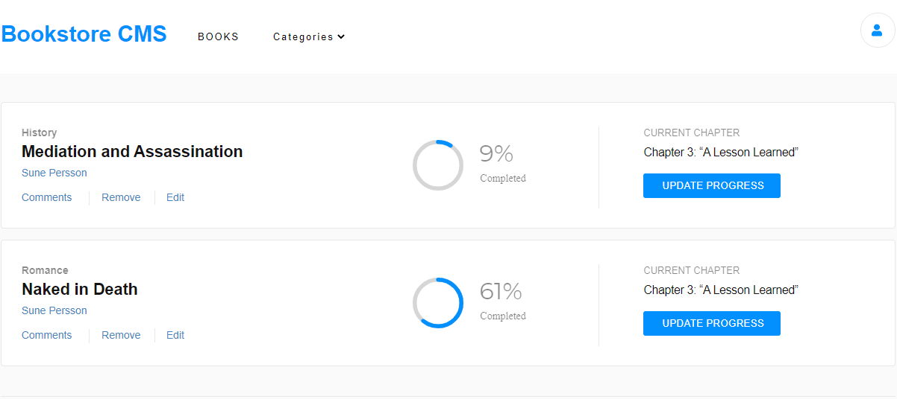

# REACT & REDUX BOOK STORE
Magic-books Inc. is a fictional company based in Germany. They have requested my help to build the front-end of an application that will help them organize and manage their bookstore. They want it to be fast, dynamic and responsive to their actions and therefore I have decided to build it with React & Redux.

## Built With
- JavaScript
- Node.js
- React
- React-Create-App
- Redux
- ES6
- CSS

## Live Demo
[heroku link](https://leonsbookstore.herokuapp.com)

## Getting Started
# Prerequisities

To run this project locally, you must have node and npm installed on your machine.

# Setup
To set up this project on your local machine:

Navigate to the folder where you want the repository to be cloned and run 

`git clone https://github.com/Leon-Mbegera/magic-books.git`

Navigate to the directory :

`cd magic-books`

To start the server: 

`npm start`

Go to http://localhost:3000/ in your browser to see the application running